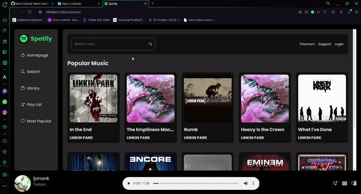

# Spotify Clone 🎧
This project is a Spotify clone built with HTML, SCSS, and JavaScript, leveraging the Shazam API to fetch real-time song data. It is fully responsive, ensuring smooth performance across all devices.

# Features:
🎵 - **Shazam API Integration:** Fetches real-time song information.
📱 - **Responsive Design:** Adapts seamlessly to all screen sizes.
🎨 - **SCSS Implementation:** Clean and maintainable styling.

# Preview:
